# UIMeter 用户手册

UIMeter为高精度电压表、电流表、功率表、欧姆表、库仑计、电能表、秒表、温度计、放电仪。

主要特性如下：

- 超宽电压范围：-9.9999V~99.9999V，安全起见建议36V以下使用。
- 超高电压精度：标准版默认0.1mV分辨率，最高可达2uV。
- 超大电流范围：标准版-9.9999A~9.9999A，软件支持到80A。
- 超高电流精度：标准版默认0.1mA电流分辨率，高分辨率版本可达1uA。
- 高精度时钟：采用外部独立晶振提供稳定时钟。
- 超大时间范围：提供最长100天时间累计显示功能。
- 高精度电量显示：同时提供Ah和Wh两种电量显示，分辨率0.1mAh、0.1mWh。高分辨率版本可达0.001mAh、0.001mWh。
- 友好的用户界面：支持多菜单界面，可以通过按键操作包括校准、设定限幅值、切换通信协议、记录数据、调整采样率、调整LCD背光在内的所有功能。
- 灵活的供电方式：可通过TTL接口供电、MicroUSB接口供电、5.08-3PIN端子供电；提供选择跳线，兼顾方便性与测量范围。
- 低功耗： LCD背光最亮时≤28mA，LCD背光最暗时≤8mA。
- 电池放电测试功能：电池放电自动切断，电压上下限可设，具备施密特特性。输出MOS管提供旁路跳线，降低通态损耗。
- 高精度温度测量：典型温度精度±1℃（自身），支持K型热电偶，NTC等外部探头测温。
- 数据离线记录功能：可支持4096条数据记录，采样间隔可调。
- 强大的通信功能：支持命令行界面、标准MODBUS协议。TTL接口可与市面上常见蓝牙串口模块HC-06无缝对接。可通过TTL转成485网络以后组网。
- USB母口D+D-外接功能：可将D+D-外接，以实现USB接口识别。
- 友好的端子布局：TTL串口、跳线均为侧装，端子无凸出不易损坏，5.08-3PIN端子可拔掉备用；按键对面屏幕插针端子可为手指提供支撑，手感舒适。

## 接口说明

### 端子布局

主板3D效果图如下：

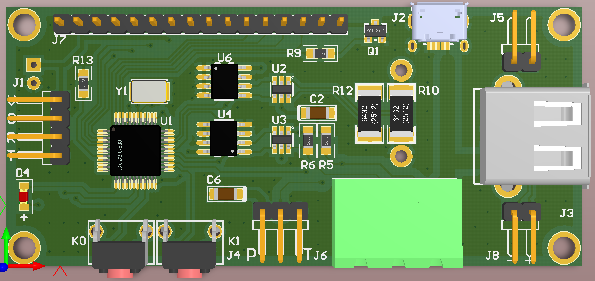

端子布局如下图：

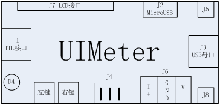

### 端子说明

端子与主要器件见下表：

| 端子号 | 功能                           | 备注                                                                               |
|-------:|:------------------------------:|:-----------------------------------------------------------------------------------|
| J1     | 5V-TTL通信接口                 | 可连接电脑、电源、蓝牙模块等                                                       |
| J2     | MicroUSB测量输入               | D+、D-悬空                                                                         |
| J3     | USB-A测量输出                  | D+、D-通过J8引出，默认短接                                                          | 
| J4     | 主板电源选择、电压增益旁路跳线 | 短接左侧可通过J1，J2，J6供电，拔下时只能通过J1供电。短接右侧可以实现2uV电压分辨率。|
| J5     | 输出开关旁路跳线               | 短路输出MOSFET，降低导通阻抗                                                       |
| J6     | 3-PIN 5.08mm输入               | 300V/15A接线端子                                                                   |
| J7     | LCD链接端子                    | 可连接1602或者TFT屏幕                                                              |
| J8     | USB母口数据线                  | +为D+，-为D-                                                                       |
| W1     | LCD对比度调节电位器            | 背面                                                                               |
| D4     | 告警指示灯                     | 电压在允许范围之外点亮                                                             |
| K0     | 左键                           | 区分长按、短按                                                                     |
| K1     | 右键                           | 区分长按、短按                                                                     |

### 外部接线原理

测量原理图如下所示：

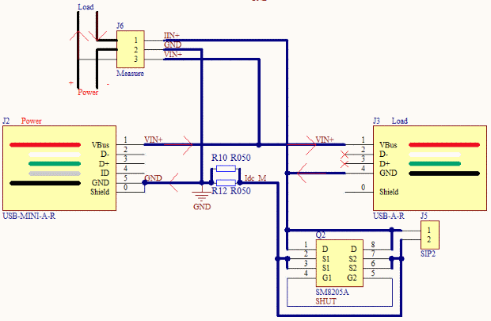

忽略J2端子和内部分断MOS管，简化为下图：

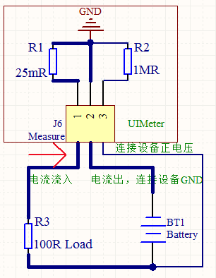

J6端子为3位5.08端子，J6的1脚为电流输入；2脚为GND，连接设备的GND；3脚为电压测量，和GND之间有1MR电阻。
图中粗线为电流流动路径。

标准版1脚和2脚之间电流取样电阻只有25mR，因此电位也十分接近。高分辨率版1脚和2脚之间
电流取样电阻为2.2欧，大电流下压差偏大，只适合小电流测量。

## 用户界面

UIMeter的用户界面由液晶屏和两个按键组成。液晶屏有1602和TFT两种，分别对应不同的用户界面。

### 按键操作定义

按键位于左下方，分别记为左键L和右键R。

按键推荐使用拇指按动，右上方插座可给食指提供有效的支撑。

按键区分长按、短按，长按时间大于1s，短按时间小于1s。

定义四种按键操作：

1. LS：短按左键，功能为↓，不同菜单下定义不同。
2. LL：长按左键，功能为ESC，不同菜单下定义不同。
3. RS：短按右键，功能为↑，不同菜单下定义不同。
4. RL：长按右键，功能为ENTER，不同菜单下定义不同。

### 1602屏幕操作流程

1602屏幕版本的操作流程图如下：

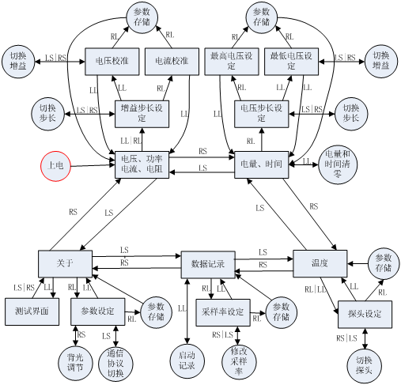

### TFT屏幕操作流程

TFT屏幕版本的操作流程图如下：

## 离线数据采集与处理

UIMeter支持离线数据记录，数据采集时无需连接电脑，设备将采集数据存储到内置存储芯片，采集过程结束以后，使用USBTTL线连接UIMeter，将数据导出。

设置UIMeter通信协议为TERM协议，使用超级终端连接UIMeter，确保命令执行正常。

### 查看离线数据

输入命令`log dump 10`，回车执行命令，结果如下图所示。

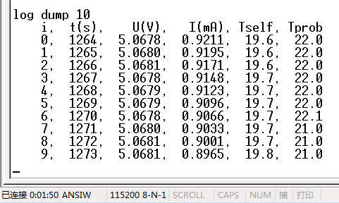

根据实际记录的数据长度来导出数据，比如导出2048条记录，命令为`log dump 2048`。

### 存储离线数据

少量数据可以直接在超级终端中查看，大量数据在超级终端中查看不便，可以导出为CSV文件，使用excel等工具做进一步分析。

导出方法如下：

超级终端中，菜单“传送->捕获文字”，弹出菜单如下图所示。输入要保存的文件名。

点击启动，然后在超级终端中输入命令`log dump 2048`，超级终端导出2048条数据，
并将数据输出到捕获文件。导出数据长度由命令决定。注意不要超过设备最长记录长度。

命令输出完成以后，菜单“传送->捕获文字->停止”，命令输出即记录到捕获文件中。
可以使用excel或者其它文本编辑器直接编辑或处理该文件。

使用UIMeterMon可以对离线记录数据进行分析处理，

### 数据结构说明

离线导出数据意义如下：

- 第一列i为数据索引，从0开始递增。
- 第二列i(s)为设备时间，以秒为单位，通过该列数据可以判断采样间隔。
- 第三列U(V)为电压，单位V。
- 第四列I(A/mA)为电流，标准版单位A，高分辨率版单位mA。
- 第五列Tself为设备板载传感器温度，单位℃。
- 第六列Tprob为探头测量到的温度，单位℃。

### 记录长度与采样率

UIMeter最大记录数据为4096条，用户需要估算测试时间，然后设定合适的采样间隔。

- 如果以最高3Hz采样，最长记录时间为4096/3=1365秒，约23分钟。
- 如果设定采样间隔为10s，记录时间为4096*10/3600=11.38小时。

对于温度等慢速信号采集，可以将采样间隔设置得更大来达到更长的测试时间。

### 记录模式

默认记录模式为：数据记录界面下长按左键开始记录，计数值按照设定的采样间隔
实时增加，记录过程中长按左键停止记录，计数值停止增加，此时再次长按左键，
从0开始记录，会覆盖上一次记录数据。如果记录到最大容量，停止记录。这种记录
模式适合记录一次完整的过程，测试之前需要估算时间，设定合适的采样间隔保证
测试时间小于UIMeter最大记录时间。

默认模式下，记录数据达到最大以后停止记录，通过打开ring模式，可以使数据达到
最大以后自动从0开始记录，覆盖旧数据。该方法可以用于循环记录，跟踪最新的测试数据。

- 使用`log ring 1`命令打开ring模式
- 使用`log ring 0`命令关闭ring模式

设定以后，如果需要掉电保存参数，需要执行`param save`命令。具体请参考命令在线帮助。

### 自动记录

默认情况下，数据离线记录功能需要用户来手动启动。如果用户需要同步采集某些量，
多台UIMeter 之间很难完成同步启动采集， 因此可以设定UIMeter上电启动以后自动
记录数据，通过给多台UIMeter同时上电来完成数据同步采集。

- 使用`log auto 1`命令打开自动记录功能
- 使用`log auto 0`命令关闭自动记录功能

设定以后，如果需要掉电保存参数，需要执行`param save`命令。具体请参考命令在线帮助。

## 供电方式

UIMeter有两种供电方式：测量端供电和独立供电。

### 测量端供电

UIMeter正常工作需要电源。J2 MicroUSB和J6 5.08-3端子都是测量端，他们的VCC和GND
并联在一起。如果测量电压在4.2V~24V之间，且待测量电压带载能力强，可以**短接J4
跳线**直接从测量端取电。

此时J1 TTL接口可悬空、接蓝牙串口模块或者对外供电，TTL接电脑无需连接VCC。

使用测量端供电UIMeter需要消耗大约10mA左右电流，这个电流会对测量结果造成一定
影响。使用J2 MicroUSB供电接触电阻偏大，电流超过1A建议使用5.08端子J6进行供电。

### 独立供电

为了达到最大测量范围，保证UIMeter稳定可靠运行，可以**断开J4跳线**使用TTL接口J1提供独立的外部供电。

使用TTL接口独立供电，MicroUSB接口输入电流与USB输出电流相等，用于测试移动电源放电、电池放电等场合准确度高。

独立供电时电源可以是外部5V USB充电器，也可以是UIPower电源模块。UIPower模块为UIMeter可选配件，可以为UIMeter提供5V独立供电。

## 通信协议

UIMeter目前支持两种通信协议：TERM协议、标准MODBUS-RTU协议，用户可以自由切换。
设备默认为TERM协议，用户可以通过串口命令直接控制设备。

### 命令行TERM协议

UIMeter内置一个命令解释器，可以通过超级终端（或者Putty、SecrueCRT）等软件来
连接。串口参数如下图所示。波特率115200、8位数据、1位停止、无校验、无流控。
详细命令请参考《[UIMeter命令行手册](UIMeterCmdRef.md)》。

### 标准MODBUS-RTU协议

UIMeter支持标准MODBUS通讯协议。通过TTL串口或者蓝牙串口连接电脑，
UIMeter切换为MODBUS协议。输入寄存器如下表所示，可以通过0x04功能码进行查询。

| 地址  | 数据       | 单位 | 格式           | 备注         |
|:-----:|:-----------|:-----|:---------------|:-------------|
| 30001 | 电压       | V    | 32位有符号整数 |  扩大10000倍 |
| 30003 | 电流       | A    | 32位有符号整数 |  扩大10000倍 |
| 30005 | 分流器电流 | A    | 32位有符号整数 |  扩大10000倍 |
| 30011 | 时间       | 秒   | 32位有符号整数 |  运行的秒数  |
| 30013 | 自身温度   | ℃   | 32位有符号整数 |  扩大10倍    |
| 30015 | 探头温度   | ℃   | 32位有符号整数 |  扩大10倍    |
| 30021 | 电量       | Ah   | 32位有符号整数 |  扩大10000倍 |
| 30023 | 电量       | Wh   | 32位有符号整数 |  扩大10000倍 |
| 30041 | 固件版本   |      | 16位无符号整数 |  Hex         |
| 30042 | 序列号0    |      | 16位无符号整数 |  Hex         |
| 30043 | 序列号1    |      | 16位无符号整数 |  Hex         |
| 30044 | 序列号2    |      | 16位无符号整数 |  Hex         |
| 30045 | 序列号3    |      | 16位无符号整数 |  Hex         |
| 30046 | 序列号4    |      | 16位无符号整数 |  Hex         |
| 30047 | 序列号5    |      | 16位无符号整数 |  Hex         |

监控软件UIMeterMon使用MODBUS协议，请参考其使用说明。

通讯举例见下图:

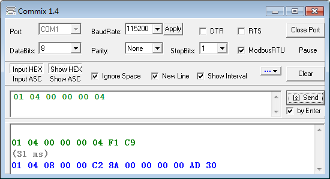

> - 上位机发送查询指令：`01 04 00 00 00 04 F1 C9`
> - 下位机应答：`01 04 08 00 00 C2 8A 00 00 00 00 AD 30`
> - 电压为：`0x0000C28A/10000=49802/10000=4.9802V`.
> - 电流为：`0x00000000/10000=0.0000A`

## 常见测试场景

### 充电器移动电源输出电压电流测试

连接J4、J5跳线，MicroUSB线插入UIMeter的MicroUSB接口，将MicruUSB线插入
USB充电器、移动电源输出，即可测量输出电压。

此时UIMeter使用MicroUSB输入供电，电流最大不超过28mA。

将负载（如电阻、没电的数码设备、USB风扇等）负载接入J3 USB接口，可测试设备输出
电流。此时通过UIMeter读取的电流不包括UIMeter本身消耗的电流。连线示意图见下图：

由于J2 MicroUSB接口接触电阻一般比较大，该接法可能带来比较大的内阻，
由于J2和J6直接并联，充电器输出也可以直接接入J6右边和中间2位。负载仍然接在J3，
如下图所示：

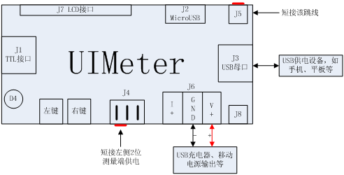

### 移动电源输出电量测量

去掉J4跳线，使用TTL接口J1对UIMeter进行独立供电；连接J5跳线，短接输出MOSFET，
降低输出电阻；移动电源输出通过MicroUSB数据线连接UIMeter的MicroUSB接口J2；
负载通过USB母座J3接入。接线图见下图所示：

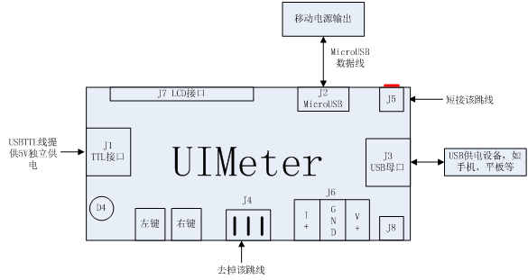

清零UIMeter电量，放电直到移动电源自动关机，从UIMeter读取放电Ah数和Wh数。

注意：

1. 必须使用外部供电，如果放电时同时使用移动电源输出作为UIMeter电源，一方面
   UIMeter自身耗电（很小）会对测试结果造成干扰；另一方面，放电结束移动电源
   自动关机，UIMeter也会因为掉电而关机，无法读取电量。
2. 一般移动电源容量使用电池电量标注，单位mAh，1000mAh=1Ah，电池电压为3.7V；
   而放电电压经过升压板以后大约为5V，不能用mAh数相除来计算转化率。推荐使用
   Wh数来计算，最为准确。如：一个标注10000mAh的移动电源，电量为10Ah，也就
   是`10*3.7=37Wh`，放电结束UImeter显示放出了30Wh电量，那么转化率为
   `30/37*100%=81.0811%`。

### 电池放电测试

UIMeter可支持各种电压等级放电测试，放电测试由于电压变化范围大，必须使用TTL接口外部供电。

接线图见下图：

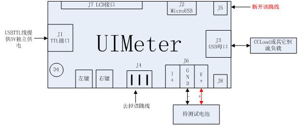

接线要点为：去掉J4跳线J1独立5V供电，如果不需要监控连接VCC和GND即可；连接监控
时可以利用TTL串口供电。J3接CCLoad或者其它恒流负载，电池通过J6接入，右正中负；
去掉J5跳线，使能输出MOSFET；**忘记断开J5跳线可能导致电池过放报废**！

设定最低电压范围，也就是放电截止电压，锂电池推荐2.8V~3V之间。放电至截止电压
以下以后，UIMeter会切断电压输出，点亮指示灯。此时读取放电Ah和Wh数。

恢复电压为放电截止电压+0.5V，一般电池设定3V截止电压，放电到3V切断输出以后
电池会有一定回升，一般0.3V左右，不超过0.5V。

### 电池充电测试

电池充电测试和通用负载测试方法相同，其接线图见下图：

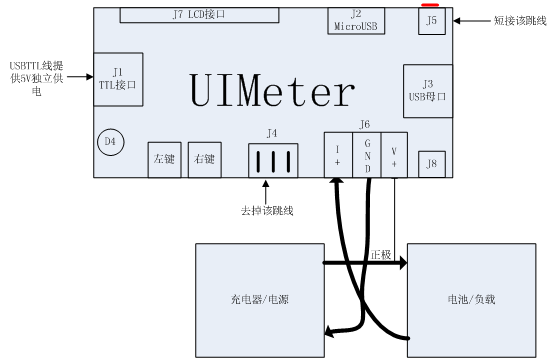

其中粗线为大电流路径，该方法为最通用的连接方法。

接线要点为：去掉J4跳线，J1独立5V供电；断开充电器（电源）与电池（负载）之间
的负极连接线，电流流出的一端接入J6左边I+,电流流入一端接入J6中间GND。正极
使用细线接入J6右端V+。

电流流动路径为：电源正->负载正->负载负->UIMeter电流入->UIMeter电流出->电源负。

### NTC5K温度测量

UIMeter内置NTC5K测温曲线，可以使用NTC5K探头进行温度测量。接线图见图 17。

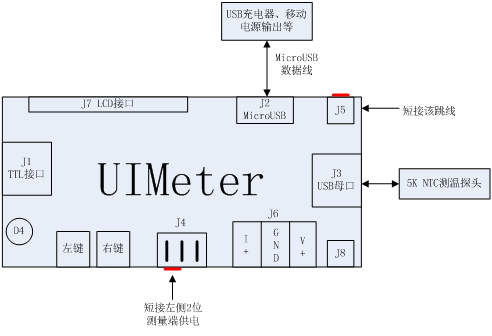

要点为：短接J4左边，从测量端供电；使用J2或者J6为UIMeter提供5V供电；切换探头类型
为NTC5K；NTC5K探头接入J3。电压电流界面显示负载阻值，温度测量界面显示实际探头温度。

注：NTC5K指的是25℃时阻值为5k欧的NTC热敏电阻。UIMeter标准版受限于电流分辨率，
对K级电阻测量不够准确，NTC5K测温功能也不够准确，要想获得比较精确的测量结果，
需使用高分辨率版本。

### K型热电偶温度测量

UIMeter内置K型热电偶测温曲线，可以使用常见K型热电偶进行温度测量。接线图见下图：

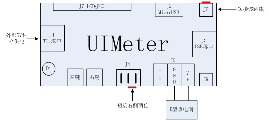

要点为：断开J4左边，从J1提供独立5V供电；短接J4右边；短接J5；将K型热电偶接入J6
右侧两位端子，背面丝印T+和T-，如果温度显示错误，两条线交换一下；切换到温度测量
界面，观测显示实时电压，环境温度和探头温度。

注：J4短接右侧2位以后，将K型热电偶更换成普通电压探头，可以进行2uV高分辨率电压
测量，范围不超过2V。

### 使用分流器扩大电流量程

去掉J4左边两位，短接J4右边两位，通过J1提供5V独立供电，J6右边两位连接分流器
测量端。通过串口命令`iset shunt`设置UIMeter分流器量程。接线图见下图：

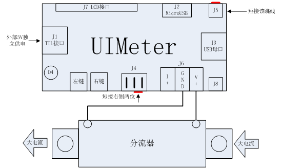

分流器也可以通过J6左边两位接入，此时需要拆除主板内置的两只检流电阻R10和R12.

## 性能指标

### 电压指标

| 指标       | 说明             | 备注                               |
|:----------:|:----------------:|:-----------------------------------|
| 显示范围   | -9.9999~99999.9V | 量程自动调节，建议36V以下使用      |
| 测量范围   | -9.9999~99.9999V | 测量4.2~5.5V以外电压需使用单独供电 |
| 电压分辨率 | 0.1mV            | -9.9999~13V                        | 
| 电压分辨率 | 0.2mV            | 13~26V                             |
| 电压分辨率 | 0.4mV            | 26~52V                             |
| 电压分辨率 | 0.8mV            | 52~99.9999V                        |
| 工作电压   | 4.2-24V          | 测量此范围外电压需独立供电         |
| 采样频率   | 3Hz              |                                    |

### 电流指标

| 指标       | 标准版           | 高分辨率版      | 备注                    |
|:----------:|:----------------:|:---------------:|:-----------------------:|
| 显示范围   | -9.9999~99999.9A | -9.999~99999.mA | 软件最大支持正向80A电流 |
| 测量范围   | -9.9999~9.9999A  | -9.999~99.999mA | 3A以上建议接J6          |
| 电流分辨率 | 0.1mA            | 1uA             | 10A内/100mA内           |
| 取样电阻   | 25mΩ             | 2.2Ω            |                         |
| 采样频率   | 3Hz              | 3Hz             |                         |

注：高分辨率版本超过100mA可正常显示，需单独校准。最大可达800mA。

### 功率指标

功率为USB接口J3的输出功率，计算方法为：`实时电压*实时电流`，单位W。

| 指标     | 标准版         | 高分辨率版    | 备注               |
|:--------:|:--------------:|:-------------:|:------------------:|
| 分辨率   | 0.0001W        | 0.001mW       | 受电压电流精度制约 |
| 范围     | 0.0000~99.999W | 0.000~9999.mW | 受散热情况制约     |
| 显示范围 | 0.0000~9999.9W | 0.000~9999.mW |                    |

### 电阻指标

电阻为USB接口J3的负载电阻，计算方法为：`实时电压/实时电流`。

标准版单位Ω，最大范围为9999.9Ω,空载时显示最大电阻9999.9Ω.

高分辨率版单位kΩ，最大范围为9999.9kΩ,空载时显示最大电阻9999.9kΩ.

| 指标     | 标准版          | 高分辨率版       | 备注               |
|:--------:|:---------------:|:----------------:|:------------------:|
| 分辨率   | 0.0001Ω        | 0.0001kΩ        | 受电压电流精度制约 |
| 范围     | 0.0000~9999.9Ω | 0.0000~9999.9kΩ | 空载时显示最大电阻 |
| 显示范围 | 0.0000~9999.9Ω | 0.0000~9999.9kΩ | 空载时显示最大电阻 |

### 电量指标

同时提供Ah和Wh显示，建议按照Wh数来估算能量。高分辨率版本提供mAh和mWh显示。
放电平均电压可用放电结束后Wh数除以Ah数来获得。

| 指标   | 标准版            | 高分辨率版      | 备注            |
|:------:|:-----------------:|:---------------:|:---------------:|
| 分辨率 | 0.0001Wh 0.001mWh |                 |                 |
| 范围   | 0.0000~99999.9Wh  | 0.000~99999.mWh | 可连续累计100Wh |
| 分辨率 | 0.0001Ah 0.001mAh |                 |                 |
| 范围   | 0.0000~99999.9Ah  | 0.000~99999.mAh |                 |

### 时间指标

外部独立晶振提供高精度时钟基准，远高于MCU内部RC振荡器。时间最大范围100天。

| 指标     |说明              | 备注       |
|:--------:|:----------------:|:----------:|
| 时间基准 | 外部独立晶振     | 硬件定时器 |
| 计时精度 | 1秒              |            |
| 计时范围 | 99天23时59分59秒 | 100天      |

### 温度指标

UIMeter机身自带TMP75测温，此外可以通过外接K型热电偶，NTC热敏电阻、PT100等
传感器进行温度测量。

注意：NTC5K与PT100测温均针对高分辨率版本。标准版对k级电阻测量能力有限。

#### TMP75温度测量指标

| 指标     |说明         | 备注                               |
|:--------:|:-----------:|:----------------------------------:|
| 显示精度 | 0.1℃       |                                    |
| 测量范围 | -40℃~125℃ | 实际测量范围受其它器件温度范围制约 |
| 测量精度 | ±1℃典型值  | 温度范围在-40℃~125℃内            |
| 采样频率 | 1Hz         |                                    |

#### K型热电偶温度测量指标

| 指标     |说明         | 备注                               |
|:--------:|:-----------:|:----------------------------------:|
| 显示精度 | 0.1℃       |                                    |
| 测量范围 | -100℃~787℃|                                    |
| 测量精度 | TBD         | 与传感器有关                       |
| 采样频率 | 1Hz         |                                    |

#### NTC5K温度测量指标

| 指标     |说明         | 备注                               |
|:--------:|:-----------:|:----------------------------------:|
| 显示精度 |  | 0.1℃    |                                    |
| 测量范围 | -30℃~150℃ |                                    |
| 测量精度 | TBD         | 与传感器有关                       |
| 采样频率 | 1Hz         |                                    |

#### PT100温度测量指标

| 指标     |说明         | 备注                               |
|:--------:|:-----------:|:----------------------------------:|
| 显示精度 | 0.1℃       |                                    |
| 测量范围 | -200℃~660℃|                                    |
| 测量精度 | TBD         | 与传感器有关                       |
| 采样频率 | 1Hz         |                                    |
